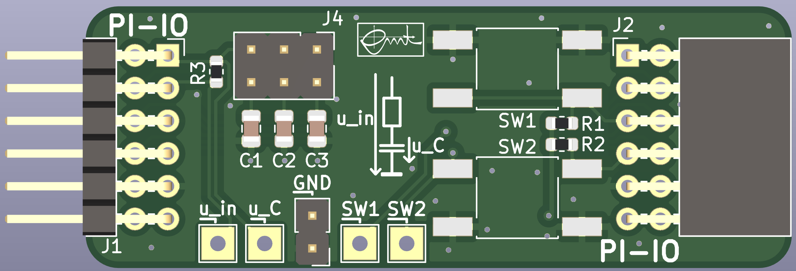

# PMI CApacitor Resistively LOaded and Switches (CARLOS)

This pcb is designed for the course PMI (Practical course Microcontroller and Interface electronics). It features two buttons and a simple capacitor load / discharge circuit.

Pin header and sockets are compatible with
[Digilents Pmod](https://digilent.com/reference/pmod/start) interface.

The board can be used with [PMI-BOB2](https://github.com/emtpb/pmi-hw-bob2)
pcb.

# Interactive BOM
An interactive html BOM page with pcb layout and material placement can be found [here](https://emtpb.github.io/pmi-hw-carlos/bom/ibom.html).

# Changelog

## 1.0
* First prototype

## 1.1
* First release

## 1.1.1
* Update project to Kicad 6
* Change the load resistance R1 of the capacitors from 10 kΩ to 1 kΩ

## 1.2
* Round pcb corners
